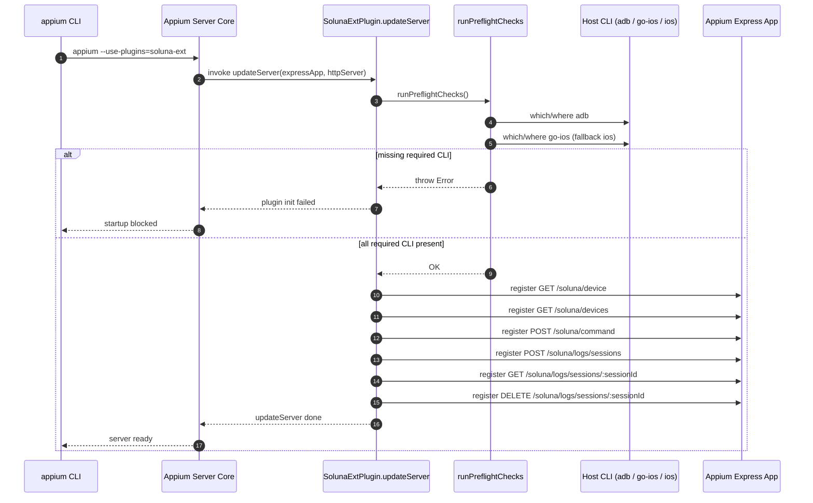
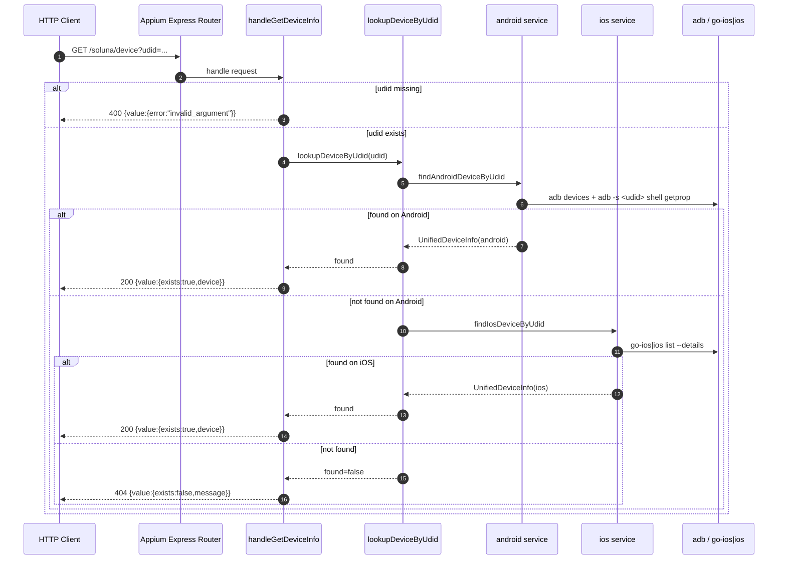
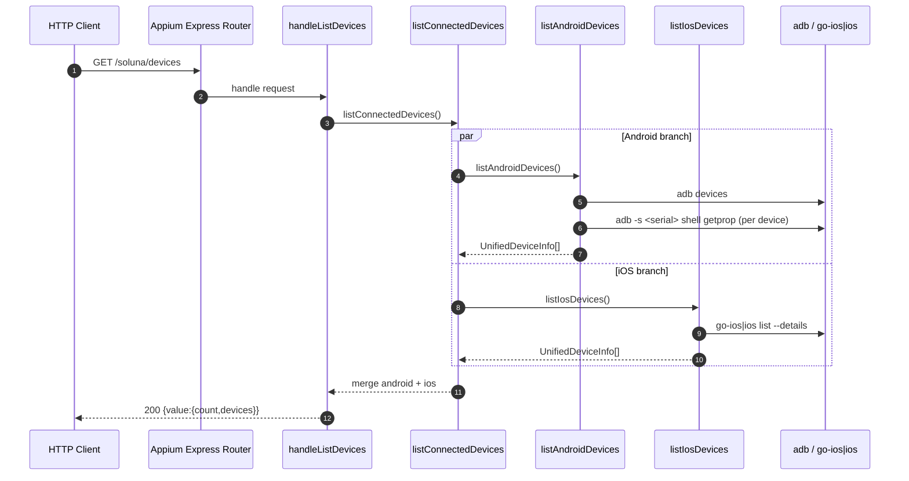
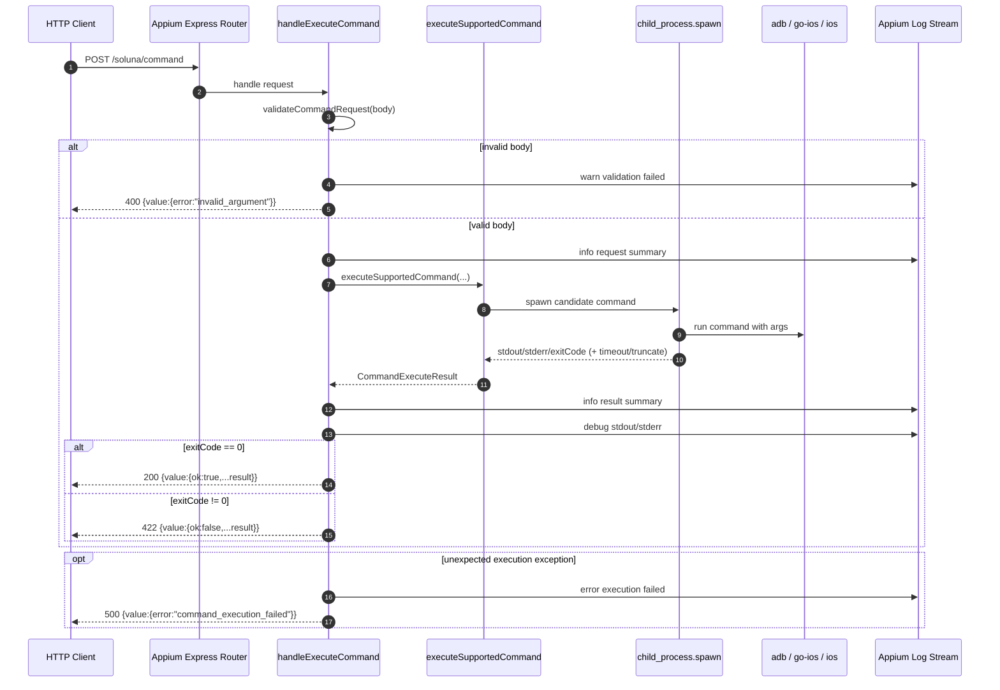
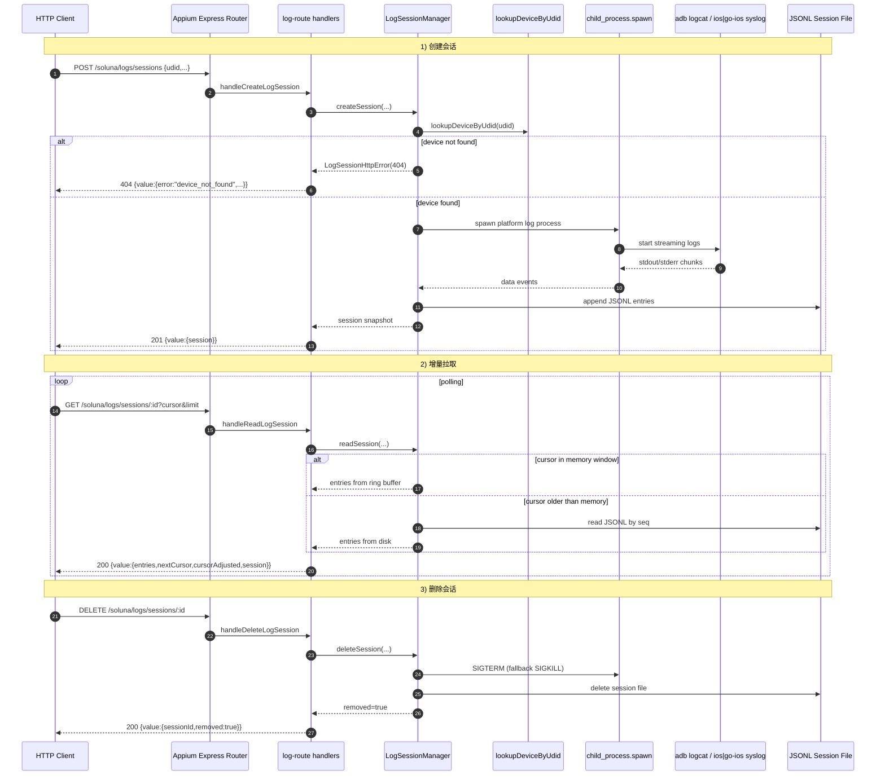

# soluna-ext 与 Appium 协作时序图

本文给出“启动阶段 + 4 类接口（含日志会话）”的时序图，便于快速理解调用链。

## 1) Appium 启动与插件挂载（含 preflight）

## 2) `GET /soluna/device?udid=...`

## 3) `GET /soluna/devices`

## 4) `POST /soluna/command`

## 5) 日志会话：创建 -> 拉取 -> 删除

## 6) 阅读建议

- 先看“启动时序图”，理解插件何时生效、何时阻断启动。
- 再看 4 个请求图，分别对应查询单设备、查询全设备、执行命令、日志会话。
- 排查问题时，建议结合“路由层状态码 + Appium 日志 + 日志会话元数据（cursor/droppedCount/status）”一起看。
